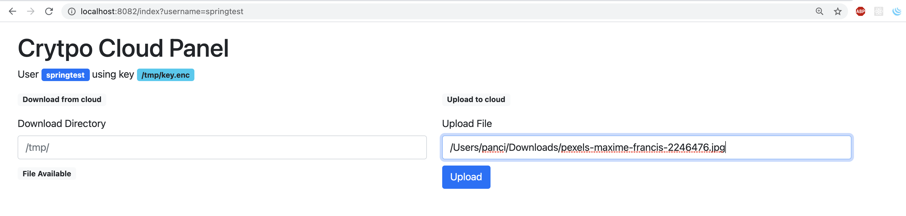
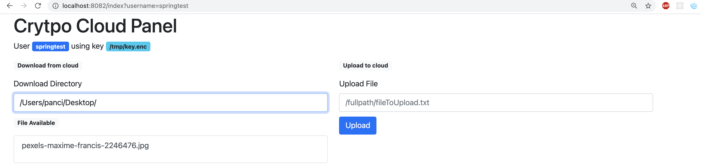

# Criptocloud 

Simple solution to load and  unload encrypted file to a remote host.

It's compose of two main applications.

The `cryptocloud-server` that receives and it stores the files in the filesystem.
The `cryptocloud-client` that crypts and it sends the files to the server. The tool can be used also without encryption.

The two applications are simple command line tools but the jars can be integrated as external jars.

The `cryptocloud-core-lib` jar contains classes common to the two project.
The `cryptocloud-encliv` jar contains the logic to provide stream encryption. 


## Communication Protocol

The communication between the node and the server use a simple custom protocol.

The communication always start with the client sending an header in the format:

```
<command>@<username>@<filename>
```

The command can be `PUT` to send a file and `GET` to retrieve it.

If the server validates the header id send a 'OK_HEADER' message

In case of `PUT` the server waits for the client to send a stream of data.
In case of `GET` is the client that it waits for the server to send data stream


## Encryption

The client encrypt/decrypt the outcoming/incoming file using the AES symmetric algorithm with a 128bit key.
More in details i use:

Algorithm: AES
Cipher mode: CBC
Padding mode: PKCS7

I use the BouncyCastle library implementation.

In case of a PUT operation the key is generated if not provided by the user.

I didn't use a 256 bit key to be able to run the project on Java8 without any particular configuration required to use a bigger key.


## Code design

A list of significant code design details:

* The data are passed leveraging on input/output streams.

* The server can accept multiple connection, each connection is managed by one thread. Since I considered that the file transfer consists in quite long connections I did not use NIO2 libraries that allows multiple connection on the same thread.

* In order to expand easily the code I use the Abstract Factory pattern in the client and server application.
Is should be easier implement different logic to store or encrypted the file. 


## Run Test

To compile all the code run from the base dir

`mvn clean package -Pstandalone` 

### Run the server

The server can be run locally or using docker.
It always listen on port 9000.


To run the server locally:

```
java -jar cryptocloud-server/target/server-0.0.1-SNAPSHOT.jar <destDir>
```

Otherwise can be run in docker 

```
(cd cryptocloud-server/; mvn docker:build docker:start)
```

### Test the client

The client can be run with the command 

```
cryptocloud-client/client.sh [PUT|GET] <file> <user> <host> <port> [keyFile]
```

for example to send the file `cryptocloud-client/testdir/sendf/test-image.jpg` using `enc.key` .
Notice that the key is generated if not present.

```
cryptocloud-client/client.sh PUT cryptocloud-client/testdir/sendf/test-image.jpg dpoletti 127.0.0.1 9000 cryptocloud-client/testdir/enc.key
```

and to retrieve it

```
cryptocloud-client/client.sh GET /tmp/test-image.jpg dpoletti 127.0.0.1 9000 cryptocloud-client/testdir/enc.key
```

In order to run a complete set op test use 

```
sh cryptocloud-client/run-test.sh
```

## Web Interface Version

The `spring-server` is a spring boot application built upon the cryptocloud server library. It provides a service to retrieve the list of uploaded file.
 In order to keep the list of the uploaded files it use a In-memory h2 database. 


The `spring-client` is a spring boot application built upon the cryptocloud client library. It provides a web page to execute the upload and download of the file.
 In order to keep the list of the uploaded files it use a In-memory h2 database. 


### Test Web Version

In order to build all the correct dependencies run from the project root `mvn clean install`.

Then it's possible to build the two springboot applications:

```
(cd cryptocloud-springserver/;mvn clean package)
(cd cryptocloud-springclient/;mvn clean package)
```

Then is possible to run the server, in this example I specify the directory where the file will be store, the port that will accept the file upload and the web interface port.
```
$ java -jar cryptocloud-springserver/target/springserver-0.0.1-SNAPSHOT.jar --crypto.destdir=/tmp/cryptocloud --crypto.port=9001 --server.port=8081
```

The client can be run in a separate terminal with this command. It will listen on port `server.port` using `crypto.keyfile`  as key file.
Obviously the port `cryptoserver.port` and `cryptoserver.restport` must coincide with the ones specified in the previous command.

```
java -jar cryptocloud-springclient/target/springclient-0.0.1-SNAPSHOT.jar --crypto.keyfile=/tmp/key.enc --cryptoserver.host=127.0.0.1 --cryptoserver.port=9001 --cryptoserver.restport=8081 --server.port=8082
```

The client interface will be available at 

```
http://localhost:8082/index?username=springtest
```

Notice that the username is passed as parameter.

In order to encrypt and upload the file use the form in the left. The full localfile path must be specified.



Refreshing the page once the file is uploaded, it should appears in the list on the right.
It's possible specify a download path and click on the filename to download and decrypt it.




## Improvement

This is a list of relevant improvement

- Improve command line interface.
- Use properties file to store configuration `org.dpoletti.cryptocloud.server.store.StoreOutputProvider`
- Add password to encryption key
- Improve Key size
- Use the client as library to create a more user-friendly application
